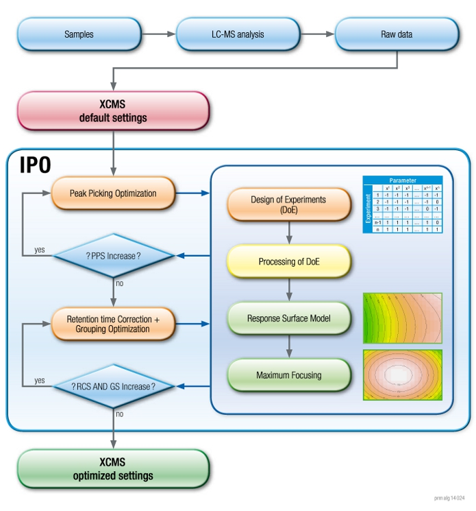
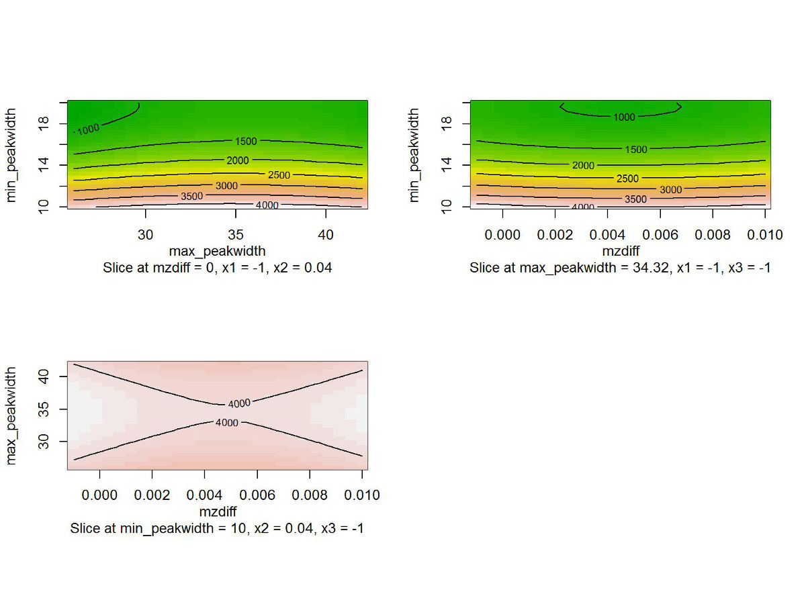
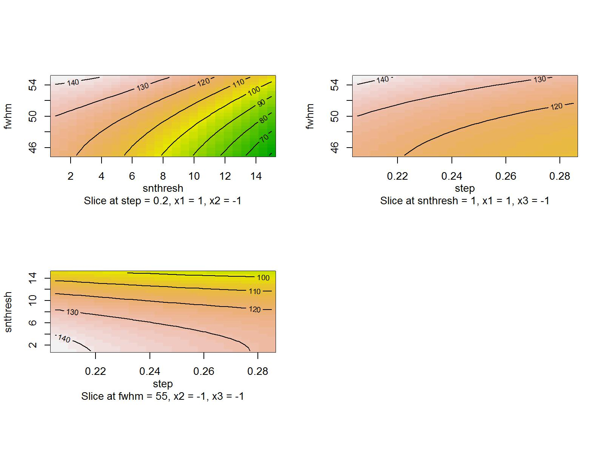
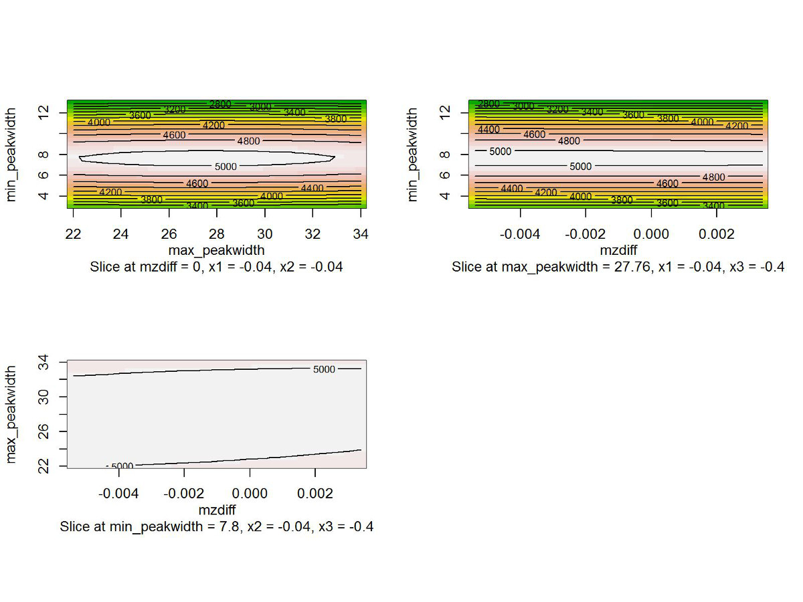
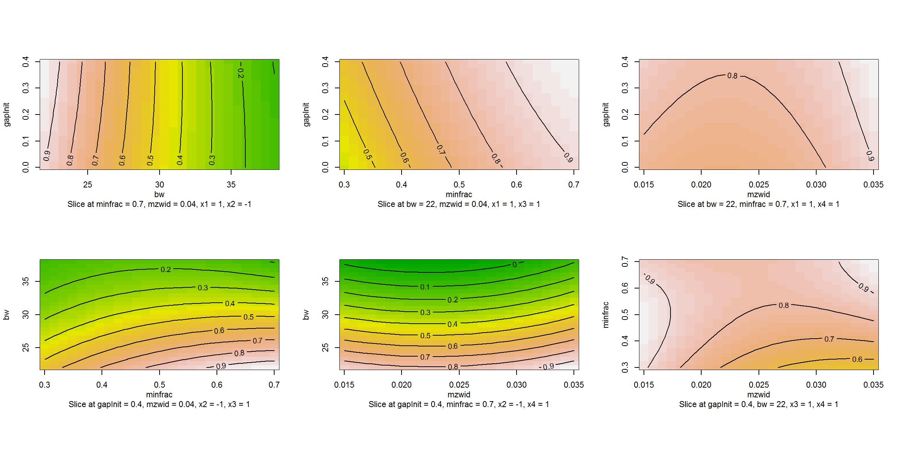
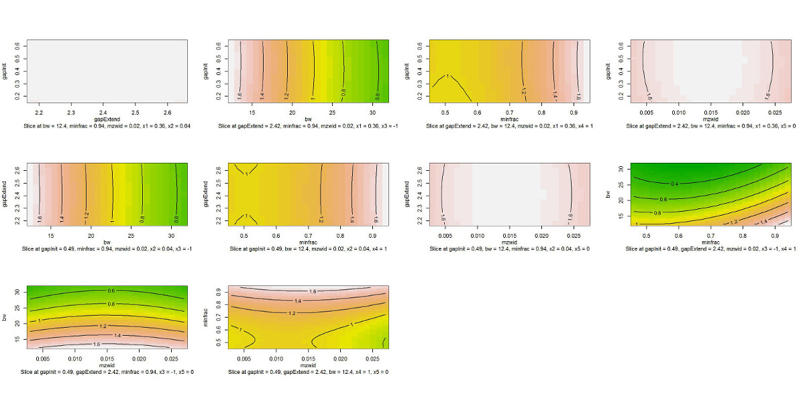
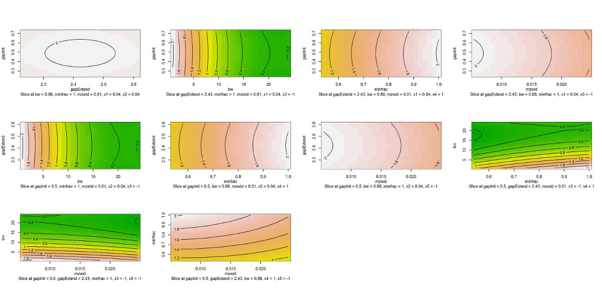
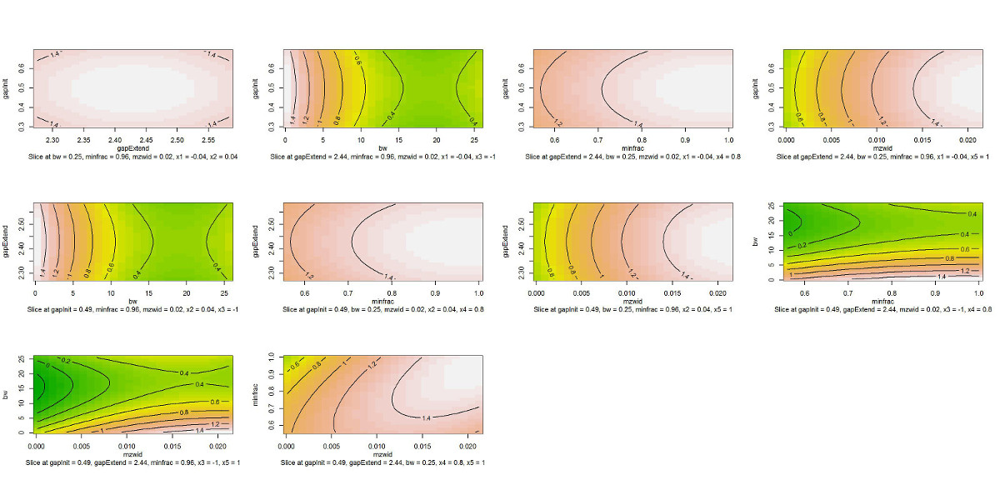

## Introduction

This document describes how to use the R-package 'IPO' 
to optimize 'xcms' parameters. Code examples on how to
use 'IPO' are provided. Additional to 'IPO' the R-packages
'xcms' and 'rsm' are required. The R-package 'msdata' and'mtbls2' 
are recommended. The optimization process looks as following:

<br>
<b>IPO optimization process</b>
<p>

</p>

## Installation

<b>Install all dependencies for IPO</b>

```{r install_IPO_dependencies, eval=FALSE}

source("http://bioconductor.org/biocLite.R")
biocLite("CAMERA")
biocLite("xcms")
install.packages("rsm")

```


<b>Install RTools</b><br><br>
  For windows:<br>
    Download and install RTools from 
      [http://cran.r-project.org/bin/windows/Rtools/](http://cran.r-project.org/bin/windows/Rtools/)<br>
  For Unix: <br>
    Install the R-development-packages (r-devel or r-base-dev)<br>
<br>
<b>Install packages needed for installation from github</b>

```{r install_devtools, eval=FALSE}

install.packages("devtools")

```

<b>Install IPO</b>

```{r install_IPO, eval=FALSE}

library("devtools")
install_github("rietho/IPO") 

```

<b>Installing suggested packages</b>

```{r install_IPO_suggestions, eval=FALSE}
# installing suggested packages
biocLite("msdata") # for examples of peak picking parameter optimization
# for examples of optimization of retention time correction and grouping
# parameters:
install_github("sneumann/mtbls2")
install.packages("RUnit") #needed for Unittest when checking the package

```


## Raw data

'xcms' handles the file processing hence all files can be used 
that can be processed by 'xcms'.


```{r file_choosing}

mzdatapath <- system.file("mzData", package = "mtbls2")
mzdatafiles <- list.files(mzdatapath, recursive = TRUE, full.names=TRUE)

```


## Optimize peak picking parameters

To optimize parameters different values (levels) have to 
tested for these parameters. To efficiently test many 
different levels design of experiment (DoE) is used. 
Box-Behnken and central composite designs set three
evenly spaced levels for each parameter. The method 
'getDefaultXcmsSetStartingParams' provides default values
for the lower and upper levels defining a range. Since
the levels are evenly spaced the middle level or center 
point is calculated automatically. To edit the starting levels
of a parameter set the lower and upper level as desired.
If a parameter should not be optimized, set a single 
default value for 'xcms' processing, do not set this
parameter to NULL. 

The method 'getDefaultXcmsSetStartingParams' creates a 
list with default values for the optimization of the
peak picking methods 'centWave' or 'matchedFilter'. To
choose between these two method set the parameter accordingly.

The method 'optimizeXcmsSet' has the following parameters:
- files: the raw data which is the basis for optimization. 
  This does not necessarly need to be the whole dataset, 
  only quality controls should suffice.
- params: a list consisting of items named according to 
  'xcms' peak picking methods parameters. A default list 
  is created by 'getDefaultXcmsSetStartingParams'.
- nSlaves: the number ofexperiments of an DoE processed in parallel
- subdir: a directory where the response surface models are
  stored. Can also be NULL if no rsm's should be saved.

The optimization process starts at the specified levels. After
the calculation of the DoE is finished the result is 
evaluated and the levels automatically set accordingly.
Then a new DoE is generated and processed. This continues 
until an optimum is found.

The result of peak picking optimization is a list consisting
of all calculated DoEs including the used levels, design, 
response, rsm and best setting. Additionally the last list 
item is a list ('\$best_settings') providing the optimized 
parameters ('\$parameters'), an xcmsSet object ('\$xset') 
calculated with these parameters and the response this 
'xcms'-object gives.


```{r optimize_peak_picking, eval=FALSE}
library(IPO)

peakpickingParameters <- getDefaultXcmsSetStartingParams('centWave')
#setting levels for min_peakwidth to 10 and 20 (hence 15 is the center point)
peakpickingParameters$min_peakwidth <- c(10,20) 
peakpickingParameters$max_peakwidth <- c(26,42)
#setting only one value for ppm therefore this parameter is not optimized
peakpickingParameters$ppm <- 20 
resultPeakpicking <- 
  optimizeXcmsSet(files = mzdatafiles[1:4], 
                  params = peakpickingParameters, 
                  nSlaves = 4, 
                  subdir = 'rsmDirectory')
optimizedXcmsSetObject <- resultPeakpicking$best_settings$xset

```


The response surface models of all optimization steps for the
parameter optimization of peak picking look as following:

<br>
<b>Response surface models of DoE 1 of peak picking parameter optimization</b>
<p></p>
<br>
<b>Response surface models of DoE 2 of peak picking parameter optimization</b>
<p></p>
<br>
<b>Response surface models of DoE 3 of peak picking parameter optimization</b>
<p></p>


```{r plot_peak_picking_rsm, echo=FALSE, fig.width=9, fig.height=7}

#  DoEs <- (length(resultPeakpicking)-1)
#  opt_params <- 
#   sum(unlist(lapply(peakpickingParameters, function(x) {length(x)==2})))
#  
#  plots <- c()
#  for(i in 1:(opt_params-1)) {
#    for(j in (i+1):opt_params) {
#      plots <- c(plots, as.formula(paste('~ x', i, '* x', j, sep='')))
#    } 
#  }
#  
#  plot_rows <- round(sqrt(length(plots)))
#  plot_cols <- 
#   if(plot_rows==1){length(plots)}else{ceiling(sqrt(length(plots)))}
#  
#  for(i in 1:3) {#(DoEs)) {
#    #plot.new()
#    par(mfrow=c(2, 2))#, oma=c(3,0,2,0))
#    max <- resultPeakpicking[[i]]$max_settings[-1]
#    max[is.na(max)] <- 1
#    contours <- contour(resultPeakpicking[[i]]$model, plots, image=TRUE, at=max) 
#    mtext(paste('Response surface models of DoE', i), side = 3, 
#     line = -2, outer = TRUE)
#  } 

```


Currently the 'xcms' peak picking methods 'centWave' 
and 'matchedFilter' are supported. The parameter 'peakwidth' of
the peak picking method 'centWave' needs two values defining
a minimum and maximum peakwidth. These two values need separate
optimization and are therefore split into 'min_peakwidth' and
'max_peakwidth' in 'getDefaultXcmsSetStartingParams'. Also for
the 'centWave' parameter prefilter two values have to be set.
To optimize these use set 'prefilter' to optimize the first value
and 'prefilter_value' to optimize the second value respectively.


## Optimize retention time correction and grouping parameters

Optimization of retention time correction and grouping
parameters is done simultaneously. The method 
'getDefaultRetGroupStartingParams' provides default 
optimization levels for the 'xcms' retention time correction
method 'obiwarp' and the grouping method 'density'. 
Modifying these levels should be done the same way done 
for the peak picking parameter optimization.

The method 'getDefaultRetGroupStartingParams' only supports
one retention time correction method ('obiwarp') and one grouping 
method ('density') at the moment. 

The method 'optimizeRetGroup' provides the following parameter:
- xset: an 'xcmsSet'-object used as basis for retention time 
  correction and grouping.
- params:  a list consisting of items named according to 'xcms' 
  retention time correction and grouping methods parameters. 
  A default list is created by 'getDefaultRetGroupStartingParams'.
- nSlaves: the number ofexperiments of an DoE processed in parallel
- subdir: a directory where the response surface models are
  stored. Can also be NULL if no rsm's should be saved.

A list is returned similar to the one returned from peak 
picking optimization. The last list item consists of the
optimized retention time correction and grouping parameters
('\$best_settings').


```{r optimize_retcor_group, eval=FALSE}
retcorGroupParameters <- getDefaultRetGroupStartingParams()
retcorGroupParameters$profStep <- 1
resultRetcorGroup <-
  optimizeRetGroup(xset = optimizedXcmsSetObject, 
                   params = retcorGroupParameters, 
                   nSlaves = 4, 
                   subdir = "rsmDirectory")

```


The response surface models of all optimization steps for the
retention time correction and grouping parameters look as following:

<br>
<b>
  Response surface models of DoE 1 of retention time correction and grouping 
  parameter optimization</b>
<p></p>
<br>
<b>
  Response surface models of DoE 2 of retention time correction and grouping 
  parameter optimizationn
</b>
<p></p>
<br>
<b>
  Response surface models of DoE 3 of retention time correction and grouping 
  parameter optimization
</b>
<p></p>
<br>
<b>
  Response surface models of DoE 4 of retention time correction and grouping 
  parameter optimization
</b>
<p></p>


```{r plot_retcor_group_rsm, echo=FALSE, fig.width=9, fig.height=7}

# DoEs <- (length(resultRetcorGroup)-1)
# opt_params <- 
#   sum(unlist(lapply(retcorGroupParameters, function(x) {length(x)==2})))
# 
# plots <- c()
# for(i in 1:(opt_params-1)) {
#   for(j in (i+1):opt_params) {
#     plots <- c(plots, as.formula(paste('~ x', i, '* x', j, sep='')))
#   } 
# }
# 
# plot_rows <- round(sqrt(length(plots)))
# plot_cols <- if(plot_rows==1){length(plots)}else{ceiling(sqrt(length(plots)))}
# 
# for(i in 1:(DoEs)) {
# #  plot.new()
#   par(mfrow=c(plot_rows, plot_cols), oma=c(3,0,2,0))
#   max <- resultRetcorGroup[[i]]$max_settings[-1]
#   max[is.na(max)] <- 1
#   contours <- contour(resultRetcorGroup[[i]]$model, plots, image=TRUE, at=max) 
#   mtext(paste('Response surface models of DoE', i), side = 3, 
#     line = -2, outer = TRUE)
# }


```

Currently the 'xcms' retention time correction method
'obiwarp' and grouping method 'density' are supported.


## Display optimized settings

A script which you can use to process your raw data
can be generated by using the function 'writeRScript'.


```{r display_settings, eval=FALSE}
writeRScript(resultPeakpicking$best_settings$parameters, 
             resultRetcorGroup$best_settings, 
             nSlaves=4)

```


